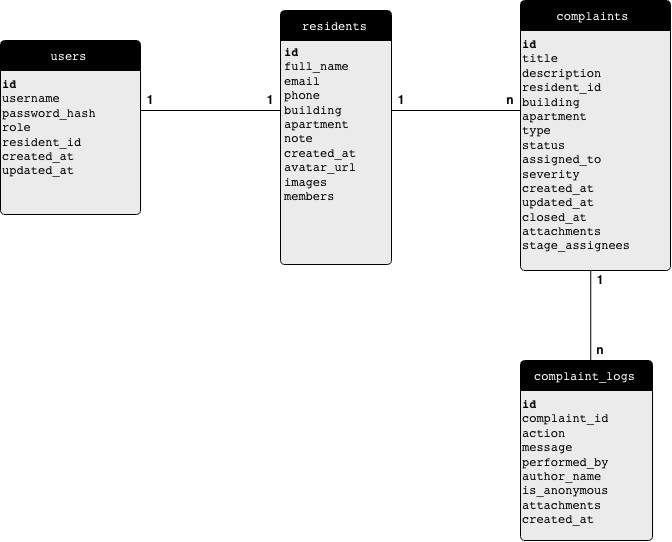
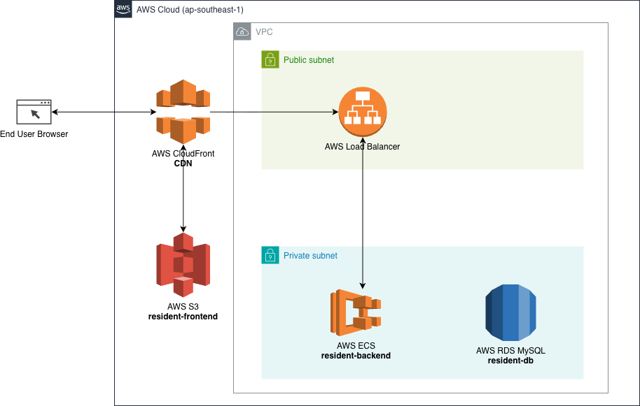

# 3. Technical Requirements

## 3.1 Proposed tech stack & reasoning

### Frontend
- **React + TypeScript** – popular, type-safe, easy to scale.
- **TailwindCSS** – fast to build UI, easy to make responsive layouts.
- **React Query** – manages API state, caching, loading, and errors.
- **Vite** – fast development and lightweight build tooling.

### Backend
- **Node.js + NestJS** – clear structure (modules/services/controllers), easy to maintain.
- RESTful API – standard approach, easy to integrate with other systems.
- Authentication with **JWT** – suitable for web and mobile clients.

### Database
- **MySQL** – familiar relational database, easy to deploy and operate.

### Cloud
- **AWS (Singapore region)** – ECS (or Fargate) for backend, S3 + CloudFront for frontend hosting, RDS MySQL for the database, CloudWatch for logging/metrics, and SSM/Secrets Manager for configuration and secrets. 

### Tooling
- ESLint + Prettier – consistent code style and fewer bugs.
- Docker – consistent development environment.
- Postman collection – quick API testing (optional).

---

## 3.2 High-level UI architecture

At a high level, the frontend is organized into four layers:

```text
┌──────────────────────────────┐
│      Presentation Layer      │  React components & screens
├──────────────────────────────┤
│   State Management Layer     │  React Query cache, AuthContext
├──────────────────────────────┤
│    Service / API Layer       │  HTTP client, API modules
├──────────────────────────────┤
│   Cross-cutting Concerns     │  Auth, routing, layout, UI kit
└──────────────────────────────┘
```

### Presentation Layer

- Location: `src/features/*`, `src/components/Layout`, `src/components/UI`.
- Renders pages (Dashboard, Residents, Complaints, Login) and layouts (`PublicLayout`, `AppLayout`).
- Uses reusable UI kit components; keeps business logic minimal and focused on user interaction.

### State Management Layer

- Location: `features/auth/AuthContext.tsx` and React Query hooks in `features/*`.
- Manages authentication/session (`AuthContext`) and server state (lists, details, timelines).
- Keeps views in sync with backend using `useQuery` / `useMutation` and a shared query cache.

### Service / API Layer

- Location: `src/api/*` (e.g. `client.ts`, `complaints.ts`, `residents.ts`, `auth.ts`, `dashboard.ts`, `mock.ts`).
- Provides a shared HTTP client and typed API functions (`listComplaints`, `getComplaint`, `login`, etc.).
- Exposes optional mock adapters so the UI can run without a real backend.

### Cross-cutting Concerns

- Location: `src/routes/*`, `features/auth`, `components/Layout`, shared utilities.
- Handles routing and access control (`App.tsx`, `ProtectedRoute`, `RoleGuard`) and global layout.
- Provides consistent styling and behavior across screens via TailwindCSS and the shared UI kit.

---

## 3.3 Key entities & relationships

The main entities in the MVP are:

- `User` – application user account (email, name, role).
- `Resident` – resident profile and apartment (building, apartment, note, images, household members).
- `Complaint` – resident complaint (title, description, type, severity, status, optional `residentId`, attachments, contact info, stage assignees).
- `ComplaintLog` – timeline entry for a complaint (action, message, performedBy, authorName, isAnonymous, attachments).

### ERD



Notes:
- Each `User` can be linked to at most one `Resident`.
- Each `Resident` can create many `Complaint` records.
- Each action on a complaint is stored as a `ComplaintLog` entry.
- Complaints can be anonymous, so `residentId` is optional; building + apartment still identify the unit.
- `performedBy` on `ComplaintLog` references the staff/admin `User` when available.

---

## 3.4 Security & roles

- Hash passwords with `bcrypt`.
- Use JWT access tokens with appropriate expiry.
- Use middleware/guards to enforce RBAC on each route.
- Validate and sanitize all input (e.g. with class-validator DTOs).
- Use HTTPS in production environments.

---

## 3.5 Code structure for maintainability

### Backend (NestJS)

```text
src/
  auth/
  users/
  residents/
  complaints/
  complaint-logs/
  announcements/
  common/
```

- Each module has its own controller, service, DTOs, and entities.
- The `common/` folder holds shared middleware, guards, filters, and utilities.

### Frontend (React)

```text
src/
  features/
    auth/
    residents/
    complaints/
    dashboard/
  components/
  api/
  utils/
  routes/
```

- `features/` contains screens and logic grouped by business domain.
- `components/` contains reusable UI components.
- `api/` contains the HTTP client, REST modules, and mock adapters.
- `routes/` defines protected routes and role-based guards.

---

## 3.6 Server infrastructure & deployment strategy

### MVP deployment
- Backend: deploy a stateless service (e.g. on ECS or equivalent).
- Frontend: build static assets and host on S3 + CloudFront (or equivalent).
- Database: RDS MySQL with regular snapshot backups.

#### AWS architecture diagram



### Scalability
- Stateless backend → easy horizontal scaling.
- Proper database indexes on frequently queried fields.
- Use a CDN for frontend assets.

---

## 3.7 Future extension ideas

- Integrate online payment for service fees.
- Facility booking (gym, BBQ, meeting room).
- Notifications via email/SMS/mobile app.
- Manage multiple buildings or complexes.
- Advanced reporting and detailed audit logs.
