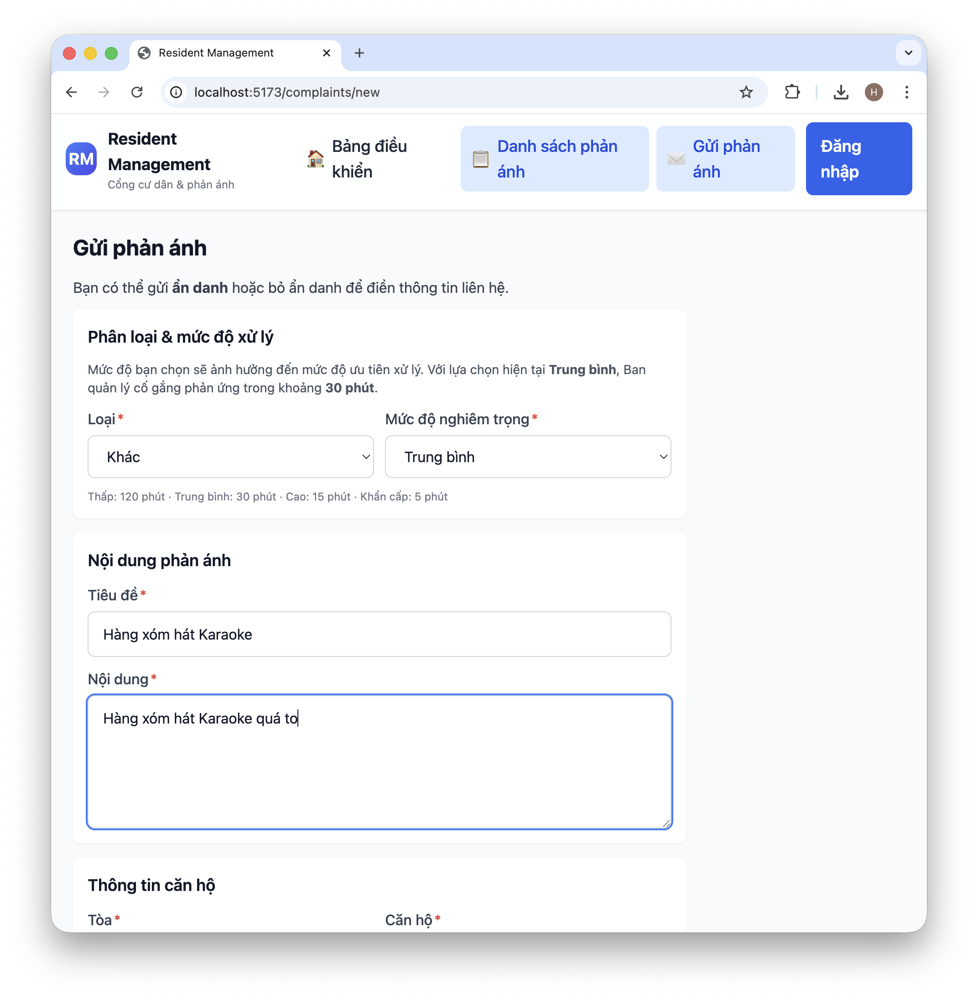
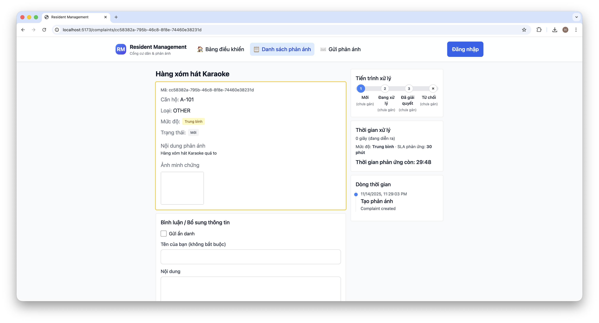
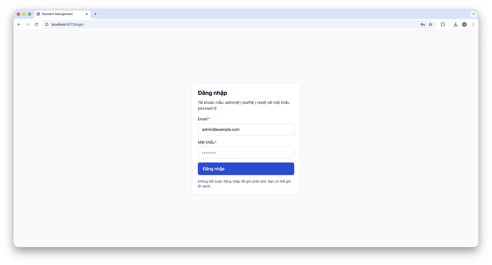
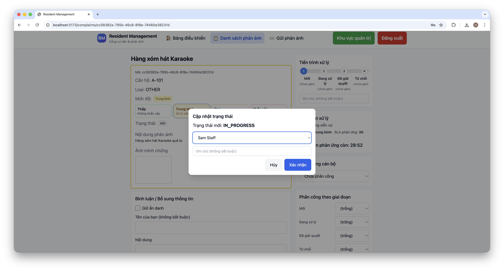
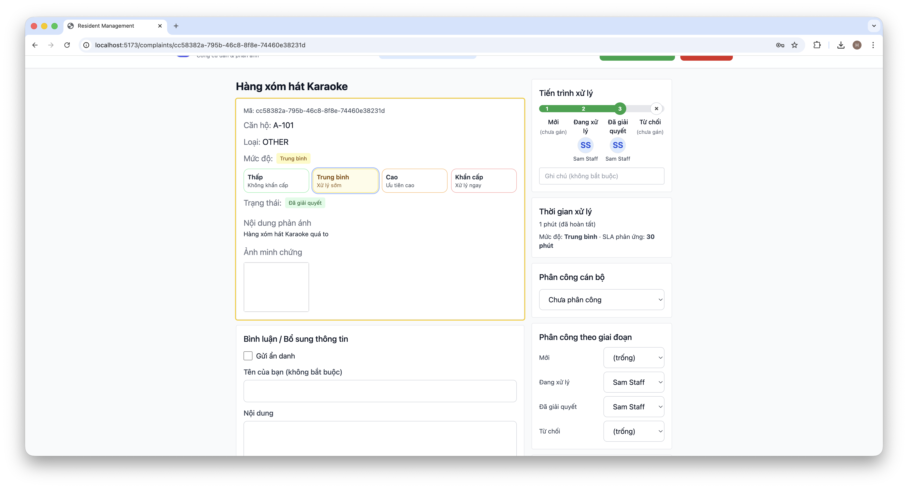

# 4. Feature Scope – Complaint Management (MVP)
## 4.1 User journeys in this module

### Resident (public flow)
- Submit a new complaint with title, description, building, apartment, type, severity and optional photos.
- Choose to submit anonymously or leave contact information (name, phone, email).
- View the public complaints list and open a complaint detail page.
- Follow the processing history (timeline) and read comments.
- Add additional comments and photos to an existing complaint.

### Staff / Admin (management flow)
- View all complaints in a management table with filters by status, type, severity, building, apartment, and free-text search.
- Open a complaint detail page to see full information, attachments, SLA indicators and processing timeline.
- Update complaint status (NEW → IN_PROGRESS → RESOLVED/REJECTED) with a note.
- Assign a primary handler and assign handlers per stage (NEW / IN_PROGRESS / RESOLVED / REJECTED).
- Change complaint severity (LOW / MEDIUM / HIGH / CRITICAL) to reflect urgency.
- Add comments (internal notes or public-facing updates) with optional photos.

---

## 4.2 Backend components (API & data model)

The backend API for this module is defined in `backend/openapi.yaml` under the **Complaints** tag.

### Main endpoints used by the MVP
- `GET /complaints` – list complaints with query filters (q, status, type, severity, building, apartment, page, pageSize).
- `POST /complaints` – create a new complaint (supports anonymous submissions and image uploads via `multipart/form-data`).
- `GET /complaints/{id}` – get complaint detail plus full `ComplaintLog` timeline.
- `PATCH /complaints/{id}/status` – update complaint status with an optional message (staff/admin only).
- `PATCH /complaints/{id}/assign` – assign a main staff handler (staff/admin only).
- `PATCH /complaints/{id}/assign-stage` – assign handler per status stage (staff/admin only).
- `PATCH /complaints/{id}/severity` – update complaint severity (staff/admin only).
- `POST /complaints/{id}/comments` – add a new comment with optional attachments (supports anonymous comments).

### 4.3 Frontend Screenshot

#### 1. Create a new complaint

#### 1. Login with admin

#### 3. List of complaint

#### 4. Update status and assign employee

